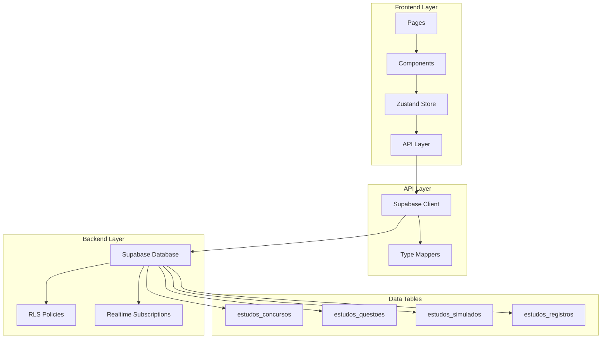

 
 # Design Document - Módulo de Estudos e Concursos

## Overview

O módulo de Estudos e Concursos é uma solução completa para auxiliar usuários com TDAH na preparação para concursos públicos. O design segue os padrões arquiteturais já estabelecidos no StayFocus, utilizando Next.js 14 (App Router), Zustand para gerenciamento de estado, Supabase para backend e Tailwind CSS para estilização.

### Objetivos do Design

- **Consistência**: Manter padrões arquiteturais do projeto
- **Performance**: Otimizar carregamento e sincronização de dados
- **Acessibilidade**: Interface adaptada para usuários com TDAH
- **Escalabilidade**: Suportar crescimento de dados (milhares de questões)
- **Segurança**: RLS e validações em todas as camadas

### Stack Tecnológica

- **Frontend**: Next.js 14, React 18, TypeScript
- **Estado**: Zustand com persistência
- **Backend**: Supabase (PostgreSQL + Realtime)
- **UI**: Tailwind CSS, Radix UI, Lucide Icons
- **Validação**: Zod
- **Testes**: Jest, React Testing Library

## Architecture

### Visão Geral da Arquitetura



### Fluxo de Dados

1. **Leitura**: Page → Store → API → Supabase → RLS Check → Data
2. **Escrita**: Component → Store Action → API → Supabase → RLS Check → Realtime Broadcast
3. **Sincronização**: Supabase Realtime → Store Update → Component Re-render

### Padrões Arquiteturais

- **Separation of Concerns**: Camadas bem definidas (UI, Estado, API, Dados)
- **Single Source of Truth**: Zustand como única fonte de verdade no cliente
- **Optimistic Updates**: Atualização imediata da UI com rollback em caso de erro
- **Real-time Sync**: Sincronização automática entre dispositivos
- **Type Safety**: TypeScript em todas as camadas

## Components and Interfaces

### Estrutura de Diretórios

```
app/
├── estudos/
│   ├── page.tsx                    # Página principal
│   ├── layout.tsx                  # Layout do módulo
│   ├── concursos/
│   │   └── [id]/
│   │       └── page.tsx            # Detalhes do concurso
│   ├── questoes/
│   │   ├── page.tsx                # Lista de questões
│   │   └── [id]/
│   │       └── page.tsx            # Detalhes da questão
│   ├── simulados/
│   │   ├── page.tsx                # Lista de simulados
│   │   ├── criar/
│   │   │   └── page.tsx            # Criar simulado
│   │   └── [id]/
│   │       ├── page.tsx            # Realizar simulado
│   │       └── resultado/
│   │           └── page.tsx        # Resultado do simulado
│   └── registros/
│       └── page.tsx                # Registros de estudo
│
├── components/
│   └── estudos/
│       ├── ConcursoCard.tsx
│       ├── ConcursoForm.tsx
│       ├── ConcursosList.tsx
│       ├── QuestaoCard.tsx
│       ├── QuestaoForm.tsx
│       ├── QuestoesList.tsx
│       ├── QuestaoViewer.tsx
│       ├── SimuladoCard.tsx
│       ├── SimuladoForm.tsx
│       ├── SimuladosList.tsx
│       ├── SimuladoPlayer.tsx
│       ├── SimuladoResultado.tsx
│       ├── RegistroEstudoForm.tsx
│       ├── RegistrosCalendar.tsx
│       ├── EstatisticasEstudo.tsx
│       └── DisciplinasChart.tsx
│
├── stores/
│   └── estudosStore.ts             # Zustand store
│
└── lib/
    └── supabase/
        ├── concursos.ts            # API de concursos
        ├── questoes.ts             # API de questões
        ├── simulados.ts            # API de simulados
        └── registros-estudo.ts     # API de registros
```

### Componentes Principais

#### 1. ConcursoCard
**Responsabilidade**: Exibir resumo de um concurso

**Props**:
```typescript
interface ConcursoCardProps {
  concurso: Concurso
  onEdit?: (id: string) => void
  onDelete?: (id: string) => void
  onClick?: (id: string) => void
}
```

**Features**:
- Badge de status (em andamento, concluído, cancelado)
- Contador de dias até a prova
- Lista de disciplinas
- Ações rápidas (editar, excluir)

#### 2. QuestaoViewer
**Responsabilidade**: Exibir questão com alternativas

**Props**:
```typescript
interface QuestaoViewerProps {
  questao: Questao
  showResposta?: boolean
  showExplicacao?: boolean
  respostaSelecionada?: string
  onSelectResposta?: (alternativa: string) => void
  modo?: 'visualizacao' | 'pratica' | 'simulado'
}
```

**Features**:
- Renderização de enunciado com formatação
- Alternativas interativas
- Feedback visual (correta/incorreta)
- Explicação expansível

#### 3. SimuladoPlayer
**Responsabilidade**: Interface para realizar simulado

**Props**:
```typescript
interface SimuladoPlayerProps {
  simulado: Simulado
  questoes: Questao[]
  onFinish: (respostas: RespostaSimulado[]) => void
}
```

**Features**:
- Navegação entre questões
- Cronômetro (opcional)
- Marcação de questões para revisão
- Progresso visual
- Confirmação antes de finalizar

#### 4. EstatisticasEstudo
**Responsabilidade**: Exibir estatísticas de estudo

**Props**:
```typescript
interface EstatisticasEstudoProps {
  userId: string
  periodo?: 'semana' | 'mes' | 'ano'
}
```

**Features**:
- Horas totais estudadas
- Distribuição por disciplina
- Gráfico de evolução
- Metas vs realizado

## Data Models

### TypeScript Interfaces

```typescript
// Concurso
export interface Concurso {
  id: string
  userId: string
  nome: string
  dataProva: string | null
  instituicao: string | null
  cargo: string | null
  disciplinas: string[]
  status: 'em_andamento' | 'concluido' | 'cancelado'
  createdAt: string
}

// Questão
export interface Questao {
  id: string
  userId: string
  concursoId: string | null
  disciplina: string
  enunciado: string
  alternativas: AlternativaQuestao[]
  respostaCorreta: string
  explicacao: string | null
  tags: string[]
  createdAt: string
}

export interface AlternativaQuestao {
  letra: 'A' | 'B' | 'C' | 'D' | 'E'
  texto: string
}

// Simulado
export interface Simulado {
  id: string
  userId: string
  concursoId: string | null
  titulo: string
  questoesIds: string[]
  dataRealizacao: string | null
  tempoLimiteMinutos: number | null
  acertos: number | null
  totalQuestoes: number | null
  createdAt: string
}

export interface RespostaSimulado {
  questaoId: string
  respostaSelecionada: string
  correta: boolean
  tempoResposta?: number
}

export interface ResultadoSimulado {
  simuladoId: string
  acertos: number
  totalQuestoes: number
  percentual: number
  tempoTotal: number
  respostas: RespostaSimulado[]
  estatisticasPorDisciplina: EstatisticaDisciplina[]
}

export interface EstatisticaDisciplina {
  disciplina: string
  acertos: number
  total: number
  percentual: number
}

// Registro de Estudo
export interface RegistroEstudo {
  id: string
  userId: string
  data: string
  disciplina: string
  duracaoMinutos: number
  topicos: string[]
  observacoes: string | null
  createdAt: string
}

// Estatísticas
export interface EstatisticasEstudo {
  totalHoras: number
  horasPorDisciplina: { disciplina: string; horas: number }[]
  mediaHorasDia: number
  diasEstudados: number
  disciplinaMaisEstudada: string
  disciplinaMenosEstudada: string
}
```

### Database Schema Mapping

```typescript
// Mapeamento entre banco de dados e tipos do cliente

// estudos_concursos
type ConcursoRow = Database['public']['Tables']['estudos_concursos']['Row']
type ConcursoInsert = Database['public']['Tables']['estudos_concursos']['Insert']
type ConcursoUpdate = Database['public']['Tables']['estudos_concursos']['Update']

function mapConcursoFromDB(row: ConcursoRow): Concurso {
  return {
    id: row.id,
    userId: row.user_id,
    nome: row.nome,
    dataProva: row.data_prova,
    instituicao: row.instituicao,
    cargo: row.cargo,
    disciplinas: row.disciplinas || [],
    status: row.status as 'em_andamento' | 'concluido' | 'cancelado',
    createdAt: row.created_at,
  }
}

// estudos_questoes
type QuestaoRow = Database['public']['Tables']['estudos_questoes']['Row']

function mapQuestaoFromDB(row: QuestaoRow): Questao {
  return {
    id: row.id,
    userId: row.user_id,
    concursoId: row.concurso_id,
    disciplina: row.disciplina,
    enunciado: row.enunciado,
    alternativas: row.alternativas as AlternativaQuestao[],
    respostaCorreta: row.resposta_correta,
    explicacao: row.explicacao,
    tags: row.tags || [],
    createdAt: row.created_at,
  }
}

// estudos_simulados
type SimuladoRow = Database['public']['Tables']['estudos_simulados']['Row']

function mapSimuladoFromDB(row: SimuladoRow): Simulado {
  return {
    id: row.id,
    userId: row.user_id,
    concursoId: row.concurso_id,
    titulo: row.titulo,
    questoesIds: row.questoes_ids || [],
    dataRealizacao: row.data_realizacao,
    tempoLimiteMinutos: row.tempo_limite_minutos,
    acertos: row.acertos,
    totalQuestoes: row.total_questoes,
    createdAt: row.created_at,
  }
}

// estudos_registros
type RegistroEstudoRow = Database['public']['Tables']['estudos_registros']['Row']

function mapRegistroEstudoFromDB(row: RegistroEstudoRow): RegistroEstudo {
  return {
    id: row.id,
    userId: row.user_id,
    data: row.data,
    disciplina: row.disciplina,
    duracaoMinutos: row.duracao_minutos,
    topicos: row.topicos || [],
    observacoes: row.observacoes,
    createdAt: row.created_at,
  }
}
```

## Error Handling

### Estratégia de Tratamento de Erros

#### 1. Camada de API
```typescript
export async function carregarConcursos(userId: string): Promise<Concurso[]> {
  try {
    const supabase = createSupabaseClient()
    
    const { data, error } = await supabase
      .from('estudos_concursos')
      .select('*')
      .eq('user_id', userId)
      .order('data_prova', { ascending: true, nullsFirst: false })
    
    if (error) {
      console.error('Erro ao carregar concursos:', error)
      throw new Error(`Erro ao carregar concursos: ${error.message}`)
    }
    
    return (data || []).map(mapConcursoFromDB)
  } catch (error) {
    console.error('Erro inesperado:', error)
    throw error
  }
}
```

#### 2. Camada de Store
```typescript
carregarConcursos: async (userId: string) => {
  set({ loading: true, error: null })
  try {
    const concursos = await carregarConcursosAPI(userId)
    set({ concursos, loading: false })
  } catch (error) {
    console.error('Error loading concursos:', error)
    set({
      error: error instanceof Error ? error.message : 'Erro ao carregar concursos',
      loading: false,
    })
  }
}
```

#### 3. Camada de Componente
```typescript
const handleSubmit = async (data: ConcursoFormData) => {
  try {
    setSubmitting(true)
    await estudosStore.adicionarConcurso(data)
    toast.success('Concurso cadastrado com sucesso!')
    onClose()
  } catch (error) {
    toast.error(error instanceof Error ? error.message : 'Erro ao cadastrar concurso')
  } finally {
    setSubmitting(false)
  }
}
```

### Tipos de Erros

- **ValidationError**: Dados inválidos (tratado no formulário)
- **AuthError**: Usuário não autenticado (redirect para login)
- **NetworkError**: Falha de conexão (retry automático)
- **DatabaseError**: Erro no Supabase (mensagem amigável)
- **NotFoundError**: Recurso não encontrado (404)
- **PermissionError**: Sem permissão (RLS)

## Testing Strategy

### Pirâmide de Testes

```
        /\
       /  \
      / E2E \
     /--------\
    /          \
   / Integration \
  /--------------\
 /                \
/   Unit Tests     \
--------------------
```

### 1. Unit Tests (70%)

**API Layer**:
```typescript
describe('concursos.ts', () => {
  describe('carregarConcursos', () => {
    it('deve carregar concursos do usuário', async () => {
      const concursos = await carregarConcursos('user-id')
      expect(concursos).toBeInstanceOf(Array)
    })
    
    it('deve lançar erro se usuário não autenticado', async () => {
      await expect(carregarConcursos('')).rejects.toThrow()
    })
  })
})
```

**Store**:
```typescript
describe('estudosStore', () => {
  it('deve adicionar concurso ao estado', async () => {
    const { result } = renderHook(() => useEstudosStore())
    await act(async () => {
      await result.current.adicionarConcurso(mockConcurso)
    })
    expect(result.current.concursos).toHaveLength(1)
  })
})
```

### 2. Integration Tests (20%)

**Componentes com Store**:
```typescript
describe('ConcursosList', () => {
  it('deve exibir lista de concursos', async () => {
    render(<ConcursosList />)
    await waitFor(() => {
      expect(screen.getByText('Concurso TRF')).toBeInTheDocument()
    })
  })
})
```

### 3. E2E Tests (10%)

**Fluxos Críticos**:
- Criar concurso → Adicionar questões → Criar simulado → Realizar → Ver resultado
- Registrar sessão de estudo → Ver estatísticas

### Cobertura Mínima

- **API Layer**: 90%
- **Store**: 85%
- **Components**: 70%
- **Utils**: 95%

## API Layer Design

### Estrutura dos Arquivos de API

#### app/lib/supabase/concursos.ts

```typescript
/**
 * Serviço de API para gerenciamento de concursos
 */

// Funções principais:
- carregarConcursos(userId: string): Promise<Concurso[]>
- carregarConcursoPorId(id: string, userId: string): Promise<Concurso>
- carregarConcursosAtivos(userId: string): Promise<Concurso[]>
- adicionarConcurso(concurso: Omit<Concurso, 'id' | 'createdAt'>, userId: string): Promise<Concurso>
- atualizarConcurso(id: string, updates: Partial<Concurso>, userId: string): Promise<Concurso>
- removerConcurso(id: string, userId: string): Promise<void>
- contarQuestoesPorConcurso(concursoId: string, userId: string): Promise<number>
- calcularDiasAteProva(dataProva: string): number
```

#### app/lib/supabase/questoes.ts

```typescript
/**
 * Serviço de API para gerenciamento de questões
 */

// Funções principais:
- carregarQuestoes(userId: string, filtros?: FiltrosQuestao): Promise<Questao[]>
- carregarQuestaoPorId(id: string, userId: string): Promise<Questao>
- carregarQuestoesPorConcurso(concursoId: string, userId: string): Promise<Questao[]>
- carregarQuestoesPorDisciplina(disciplina: string, userId: string): Promise<Questao[]>
- buscarQuestoes(termo: string, userId: string): Promise<Questao[]>
- adicionarQuestao(questao: Omit<Questao, 'id' | 'createdAt'>, userId: string): Promise<Questao>
- atualizarQuestao(id: string, updates: Partial<Questao>, userId: string): Promise<Questao>
- removerQuestao(id: string, userId: string): Promise<void>
- validarQuestao(questao: Partial<Questao>): ValidationResult
- gerarQuestoesAleatorias(filtros: FiltrosAleatorio, quantidade: number, userId: string): Promise<Questao[]>
```

#### app/lib/supabase/simulados.ts

```typescript
/**
 * Serviço de API para gerenciamento de simulados
 */

// Funções principais:
- carregarSimulados(userId: string): Promise<Simulado[]>
- carregarSimuladoPorId(id: string, userId: string): Promise<Simulado>
- carregarSimuladosRealizados(userId: string): Promise<Simulado[]>
- criarSimulado(simulado: Omit<Simulado, 'id' | 'createdAt'>, userId: string): Promise<Simulado>
- iniciarSimulado(simuladoId: string, userId: string): Promise<void>
- finalizarSimulado(simuladoId: string, respostas: RespostaSimulado[], userId: string): Promise<ResultadoSimulado>
- calcularResultado(simuladoId: string, respostas: RespostaSimulado[], questoes: Questao[]): ResultadoSimulado
- removerSimulado(id: string, userId: string): Promise<void>
- carregarQuestoesSimulado(simuladoId: string, userId: string): Promise<Questao[]>
```

#### app/lib/supabase/registros-estudo.ts

```typescript
/**
 * Serviço de API para gerenciamento de registros de estudo
 */

// Funções principais:
- carregarRegistros(userId: string, dataInicio?: string, dataFim?: string): Promise<RegistroEstudo[]>
- carregarRegistroPorId(id: string, userId: string): Promise<RegistroEstudo>
- carregarRegistrosPorMes(userId: string, ano: number, mes: number): Promise<RegistroEstudo[]>
- adicionarRegistro(registro: Omit<RegistroEstudo, 'id' | 'createdAt'>, userId: string): Promise<RegistroEstudo>
- atualizarRegistro(id: string, updates: Partial<RegistroEstudo>, userId: string): Promise<RegistroEstudo>
- removerRegistro(id: string, userId: string): Promise<void>
- calcularEstatisticas(userId: string, dataInicio?: string, dataFim?: string): Promise<EstatisticasEstudo>
- calcularHorasPorDisciplina(userId: string, periodo: string): Promise<{ disciplina: string; horas: number }[]>
```

### Padrões de Query

#### Paginação
```typescript
export async function carregarQuestoesPaginadas(
  userId: string,
  page: number = 1,
  pageSize: number = 20
): Promise<{ questoes: Questao[]; total: number }> {
  const supabase = createSupabaseClient()
  
  const from = (page - 1) * pageSize
  const to = from + pageSize - 1
  
  const { data, error, count } = await supabase
    .from('estudos_questoes')
    .select('*', { count: 'exact' })
    .eq('user_id', userId)
    .order('created_at', { ascending: false })
    .range(from, to)
  
  if (error) throw new Error(`Erro ao carregar questões: ${error.message}`)
  
  return {
    questoes: (data || []).map(mapQuestaoFromDB),
    total: count || 0,
  }
}
```

#### Filtros Complexos
```typescript
export interface FiltrosQuestao {
  concursoId?: string
  disciplina?: string
  tags?: string[]
  busca?: string
}

export async function carregarQuestoesComFiltros(
  userId: string,
  filtros: FiltrosQuestao
): Promise<Questao[]> {
  const supabase = createSupabaseClient()
  
  let query = supabase
    .from('estudos_questoes')
    .select('*')
    .eq('user_id', userId)
  
  if (filtros.concursoId) {
    query = query.eq('concurso_id', filtros.concursoId)
  }
  
  if (filtros.disciplina) {
    query = query.eq('disciplina', filtros.disciplina)
  }
  
  if (filtros.tags && filtros.tags.length > 0) {
    query = query.contains('tags', filtros.tags)
  }
  
  if (filtros.busca) {
    query = query.ilike('enunciado', `%${filtros.busca}%`)
  }
  
  const { data, error } = await query.order('created_at', { ascending: false })
  
  if (error) throw new Error(`Erro ao carregar questões: ${error.message}`)
  
  return (data || []).map(mapQuestaoFromDB)
}
```

## Store Design

### Zustand Store Structure

```typescript
interface EstudosState {
  // Estados
  concursos: Concurso[]
  questoes: Questao[]
  simulados: Simulado[]
  registros: RegistroEstudo[]
  loading: boolean
  error: string | null
  
  // Estados de UI
  concursoSelecionado: Concurso | null
  questaoSelecionada: Questao | null
  simuladoEmAndamento: Simulado | null
  
  // Estatísticas
  estatisticas: EstatisticasEstudo | null
  
  // Ações - Concursos
  carregarConcursos: (userId: string) => Promise<void>
  adicionarConcurso: (concurso: Omit<Concurso, 'id' | 'createdAt'>) => Promise<void>
  atualizarConcurso: (id: string, updates: Partial<Concurso>) => Promise<void>
  removerConcurso: (id: string) => Promise<void>
  selecionarConcurso: (concurso: Concurso | null) => void
  
  // Ações - Questões
  carregarQuestoes: (userId: string, filtros?: FiltrosQuestao) => Promise<void>
  adicionarQuestao: (questao: Omit<Questao, 'id' | 'createdAt'>) => Promise<void>
  atualizarQuestao: (id: string, updates: Partial<Questao>) => Promise<void>
  removerQuestao: (id: string) => Promise<void>
  buscarQuestoes: (termo: string) => Promise<void>
  
  // Ações - Simulados
  carregarSimulados: (userId: string) => Promise<void>
  criarSimulado: (simulado: Omit<Simulado, 'id' | 'createdAt'>) => Promise<void>
  iniciarSimulado: (simuladoId: string) => Promise<void>
  finalizarSimulado: (simuladoId: string, respostas: RespostaSimulado[]) => Promise<ResultadoSimulado>
  removerSimulado: (id: string) => Promise<void>
  
  // Ações - Registros
  carregarRegistros: (userId: string, dataInicio?: string, dataFim?: string) => Promise<void>
  adicionarRegistro: (registro: Omit<RegistroEstudo, 'id' | 'createdAt'>) => Promise<void>
  atualizarRegistro: (id: string, updates: Partial<RegistroEstudo>) => Promise<void>
  removerRegistro: (id: string) => Promise<void>
  carregarEstatisticas: (userId: string, periodo?: string) => Promise<void>
  
  // Real-time
  setupRealtimeSync: (userId: string) => () => void
  
  // Helpers
  obterConcursoPorId: (id: string) => Concurso | undefined
  obterQuestaoPorId: (id: string) => Questao | undefined
  obterSimuladoPorId: (id: string) => Simulado | undefined
}
```

### Optimistic Updates

```typescript
adicionarQuestao: async (questao) => {
  const tempId = `temp-${Date.now()}`
  const questaoTemp: Questao = {
    ...questao,
    id: tempId,
    createdAt: new Date().toISOString(),
  }
  
  // Atualização otimista
  set(state => ({
    questoes: [questaoTemp, ...state.questoes]
  }))
  
  try {
    const supabase = createSupabaseClient()
    const { data: { user } } = await supabase.auth.getUser()
    if (!user) throw new Error('Usuário não autenticado')
    
    const novaQuestao = await adicionarQuestaoAPI(questao, user.id)
    
    // Substituir questão temporária pela real
    set(state => ({
      questoes: state.questoes.map(q => q.id === tempId ? novaQuestao : q),
      loading: false,
    }))
  } catch (error) {
    // Rollback em caso de erro
    set(state => ({
      questoes: state.questoes.filter(q => q.id !== tempId),
      error: error instanceof Error ? error.message : 'Erro ao adicionar questão',
      loading: false,
    }))
    throw error
  }
}
```

## UI/UX Design

### Design Principles

1. **Clareza Visual**: Informações organizadas hierarquicamente
2. **Feedback Imediato**: Todas as ações têm resposta visual
3. **Redução de Carga Cognitiva**: Máximo 3-4 elementos por tela
4. **Consistência**: Padrões visuais do StayFocus
5. **Acessibilidade**: WCAG 2.1 AA compliance

### Páginas Principais

#### 1. Dashboard de Estudos (`/estudos`)

**Layout**:
```
┌─────────────────────────────────────────┐
│ Estudos e Concursos                     │
├─────────────────────────────────────────┤
│                                         │
│ ┌─────────────┐ ┌─────────────┐       │
│ │ Concursos   │ │ Questões    │       │
│ │ Ativos: 3   │ │ Total: 245  │       │
│ └─────────────┘ └─────────────┘       │
│                                         │
│ ┌─────────────┐ ┌─────────────┐       │
│ │ Simulados   │ │ Horas/Semana│       │
│ │ Realizados:5│ │ 12h 30min   │       │
│ └─────────────┘ └─────────────┘       │
│                                         │
│ Concursos em Andamento                 │
│ ┌─────────────────────────────────┐   │
│ │ TRF 2ª Região                   │   │
│ │ Faltam 45 dias | 120 questões   │   │
│ └─────────────────────────────────┘   │
│                                         │
│ Ações Rápidas                          │
│ [+ Adicionar Questão] [Novo Simulado]  │
└─────────────────────────────────────────┘
```

#### 2. Lista de Questões (`/estudos/questoes`)

**Features**:
- Filtros: Concurso, Disciplina, Tags
- Busca por texto
- Ordenação: Data, Disciplina
- Ações em lote: Adicionar a simulado, Exportar
- Paginação ou scroll infinito

**Card de Questão**:
```
┌─────────────────────────────────────┐
│ [Disciplina Badge] [Tags...]        │
│                                     │
│ Enunciado da questão...             │
│                                     │
│ A) Alternativa A                    │
│ B) Alternativa B                    │
│ C) Alternativa C                    │
│                                     │
│ [Ver Resposta] [Editar] [Excluir]  │
└─────────────────────────────────────┘
```

#### 3. Realizar Simulado (`/estudos/simulados/[id]`)

**Layout**:
```
┌─────────────────────────────────────────┐
│ Simulado: TRF - Direito Constitucional │
│ Questão 5 de 20 | ⏱️ 45:23             │
├─────────────────────────────────────────┤
│                                         │
│ Enunciado da questão 5...              │
│                                         │
│ ○ A) Alternativa A                     │
│ ○ B) Alternativa B                     │
│ ○ C) Alternativa C                     │
│ ○ D) Alternativa D                     │
│ ○ E) Alternativa E                     │
│                                         │
│ [⭐ Marcar para Revisão]                │
│                                         │
│ [← Anterior]  [Próxima →]              │
│                                         │
│ Navegação: [1][2][3][4][5⭐][6]...     │
│                                         │
│ [Finalizar Simulado]                   │
└─────────────────────────────────────────┘
```

#### 4. Resultado do Simulado (`/estudos/simulados/[id]/resultado`)

**Seções**:
1. **Resumo Geral**
   - Acertos: 15/20 (75%)
   - Tempo total: 1h 23min
   - Gráfico de pizza

2. **Por Disciplina**
   - Tabela com disciplina, acertos, total, %
   - Gráfico de barras

3. **Questões Detalhadas**
   - Lista de questões com resposta dada vs correta
   - Explicações

4. **Ações**
   - Refazer simulado
   - Revisar questões erradas
   - Exportar PDF

### Componentes de UI

#### Estados Vazios

```typescript
<EmptyState
  icon={BookOpen}
  title="Nenhum concurso cadastrado"
  description="Comece adicionando um concurso que você está estudando"
  action={{
    label: "Adicionar Concurso",
    onClick: handleAddConcurso
  }}
/>
```

#### Loading States

```typescript
<SkeletonCard /> // Para cards
<SkeletonList rows={5} /> // Para listas
<LoadingSpinner /> // Para ações
```

#### Feedback Visual

```typescript
// Toast notifications
toast.success('Questão adicionada com sucesso!')
toast.error('Erro ao salvar simulado')
toast.info('Simulado iniciado')

// Confirmações
<ConfirmDialog
  title="Remover concurso?"
  description="Isso também removerá todas as questões vinculadas."
  onConfirm={handleDelete}
/>
```

### Responsividade

#### Breakpoints
- Mobile: < 640px
- Tablet: 640px - 1024px
- Desktop: > 1024px

#### Adaptações Mobile
- Cards em coluna única
- Menu hamburguer
- Botões flutuantes para ações principais
- Navegação por tabs no simulado

## Performance Optimization

### Estratégias

#### 1. Code Splitting
```typescript
// Lazy loading de páginas pesadas
const SimuladoPlayer = dynamic(() => import('@/app/components/estudos/SimuladoPlayer'), {
  loading: () => <LoadingSpinner />,
  ssr: false
})
```

#### 2. Memoization
```typescript
const QuestaoCard = memo(({ questao }: QuestaoCardProps) => {
  // Component implementation
}, (prevProps, nextProps) => {
  return prevProps.questao.id === nextProps.questao.id
})
```

#### 3. Virtual Scrolling
```typescript
// Para listas grandes de questões
import { useVirtualizer } from '@tanstack/react-virtual'

const QuestoesList = () => {
  const parentRef = useRef<HTMLDivElement>(null)
  
  const virtualizer = useVirtualizer({
    count: questoes.length,
    getScrollElement: () => parentRef.current,
    estimateSize: () => 200,
  })
  
  // Render virtual items
}
```

#### 4. Debounce em Buscas
```typescript
const debouncedSearch = useMemo(
  () => debounce((term: string) => {
    estudosStore.buscarQuestoes(term)
  }, 300),
  []
)
```

#### 5. Cache de Queries
```typescript
// Cache de questões carregadas
const questoesCache = new Map<string, Questao[]>()

export async function carregarQuestoesComCache(
  userId: string,
  filtros: FiltrosQuestao
): Promise<Questao[]> {
  const cacheKey = JSON.stringify({ userId, filtros })
  
  if (questoesCache.has(cacheKey)) {
    return questoesCache.get(cacheKey)!
  }
  
  const questoes = await carregarQuestoesComFiltros(userId, filtros)
  questoesCache.set(cacheKey, questoes)
  
  return questoes
}
```

### Database Indexes

```sql
-- Índices para otimização de queries

-- Concursos
CREATE INDEX idx_estudos_concursos_user_status 
ON estudos_concursos(user_id, status);

CREATE INDEX idx_estudos_concursos_data_prova 
ON estudos_concursos(data_prova) 
WHERE data_prova IS NOT NULL;

-- Questões
CREATE INDEX idx_estudos_questoes_user_concurso 
ON estudos_questoes(user_id, concurso_id);

CREATE INDEX idx_estudos_questoes_disciplina 
ON estudos_questoes(user_id, disciplina);

CREATE INDEX idx_estudos_questoes_tags 
ON estudos_questoes USING GIN(tags);

CREATE INDEX idx_estudos_questoes_busca 
ON estudos_questoes USING GIN(to_tsvector('portuguese', enunciado));

-- Simulados
CREATE INDEX idx_estudos_simulados_user_data 
ON estudos_simulados(user_id, data_realizacao DESC);

CREATE INDEX idx_estudos_simulados_concurso 
ON estudos_simulados(concurso_id) 
WHERE concurso_id IS NOT NULL;

-- Registros
CREATE INDEX idx_estudos_registros_user_data 
ON estudos_registros(user_id, data DESC);

CREATE INDEX idx_estudos_registros_disciplina 
ON estudos_registros(user_id, disciplina);
```

## Security

### Row Level Security (RLS)

```sql
-- Política para estudos_concursos
CREATE POLICY "Users can only access their own concursos"
ON estudos_concursos
FOR ALL
USING (auth.uid() = user_id);

-- Política para estudos_questoes
CREATE POLICY "Users can only access their own questoes"
ON estudos_questoes
FOR ALL
USING (auth.uid() = user_id);

-- Política para estudos_simulados
CREATE POLICY "Users can only access their own simulados"
ON estudos_simulados
FOR ALL
USING (auth.uid() = user_id);

-- Política para estudos_registros
CREATE POLICY "Users can only access their own registros"
ON estudos_registros
FOR ALL
USING (auth.uid() = user_id);
```

### Validações

#### Client-side (Zod)
```typescript
import { z } from 'zod'

export const concursoSchema = z.object({
  nome: z.string().min(3, 'Nome deve ter no mínimo 3 caracteres').max(200),
  dataProva: z.string().optional().refine(
    (date) => !date || new Date(date) > new Date(),
    'Data da prova deve ser futura'
  ),
  instituicao: z.string().max(200).optional(),
  cargo: z.string().max(200).optional(),
  disciplinas: z.array(z.string()).min(1, 'Adicione pelo menos uma disciplina'),
  status: z.enum(['em_andamento', 'concluido', 'cancelado']),
})

export const questaoSchema = z.object({
  enunciado: z.string().min(10, 'Enunciado muito curto'),
  alternativas: z.array(z.object({
    letra: z.enum(['A', 'B', 'C', 'D', 'E']),
    texto: z.string().min(1)
  })).min(2).max(5),
  respostaCorreta: z.enum(['A', 'B', 'C', 'D', 'E']),
  disciplina: z.string().min(1),
  explicacao: z.string().optional(),
  tags: z.array(z.string()).optional(),
})
```

#### Server-side (Database Constraints)
```sql
-- Constraints já existentes no banco
ALTER TABLE estudos_concursos
ADD CONSTRAINT check_status 
CHECK (status IN ('em_andamento', 'concluido', 'cancelado'));

ALTER TABLE estudos_questoes
ADD CONSTRAINT check_alternativas_count
CHECK (jsonb_array_length(alternativas) BETWEEN 2 AND 5);

ALTER TABLE estudos_registros
ADD CONSTRAINT check_duracao_positiva
CHECK (duracao_minutos > 0);
```

## Migration Strategy

### Fase 1: Setup Inicial
- Criar estrutura de diretórios
- Configurar tipos TypeScript
- Implementar API layer básica

### Fase 2: Core Features
- Implementar CRUD de concursos
- Implementar CRUD de questões
- Criar store Zustand

### Fase 3: Simulados
- Implementar criação de simulados
- Implementar player de simulados
- Implementar cálculo de resultados

### Fase 4: Registros e Estatísticas
- Implementar registros de estudo
- Criar dashboards de estatísticas
- Implementar gráficos

### Fase 5: Polimento
- Otimizações de performance
- Testes completos
- Documentação

---

**Última atualização:** 20 de Outubro de 2025
