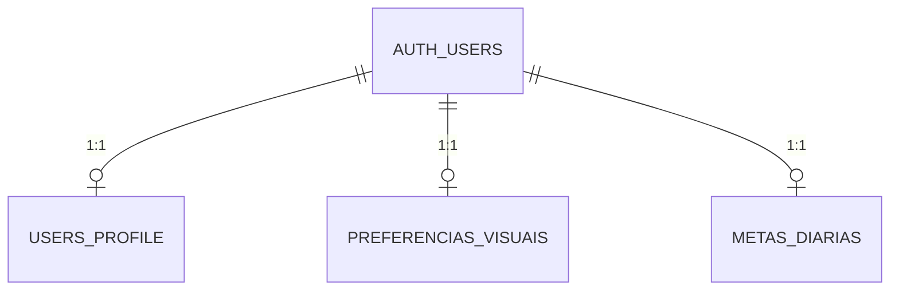
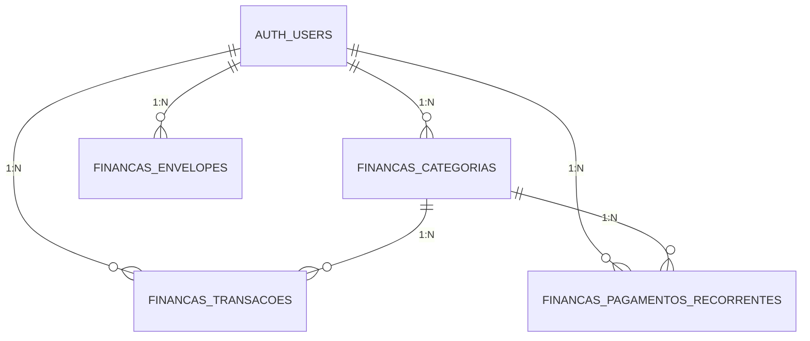
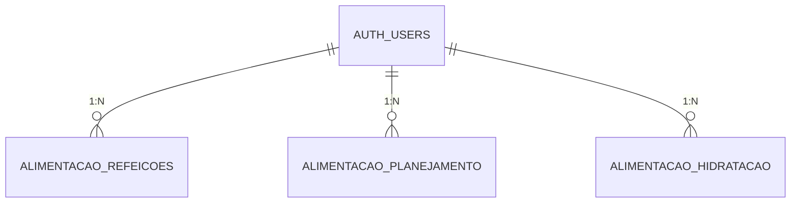
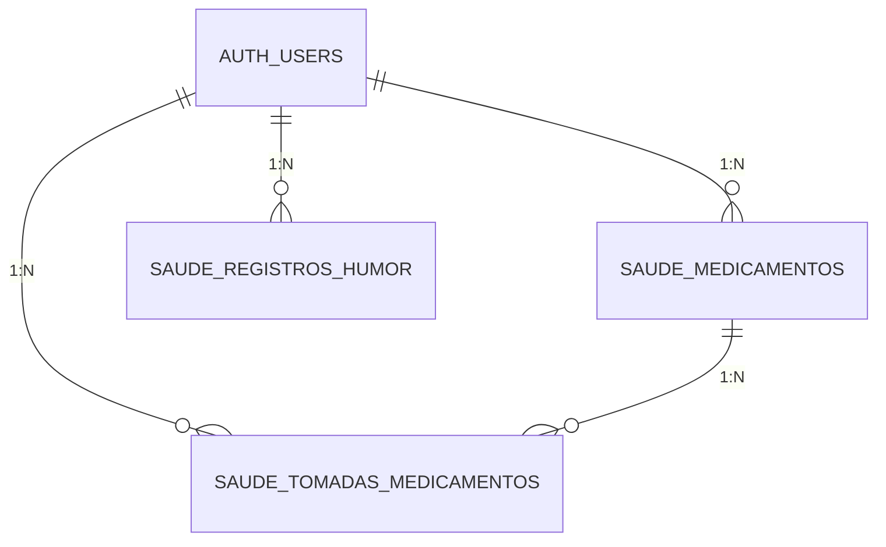
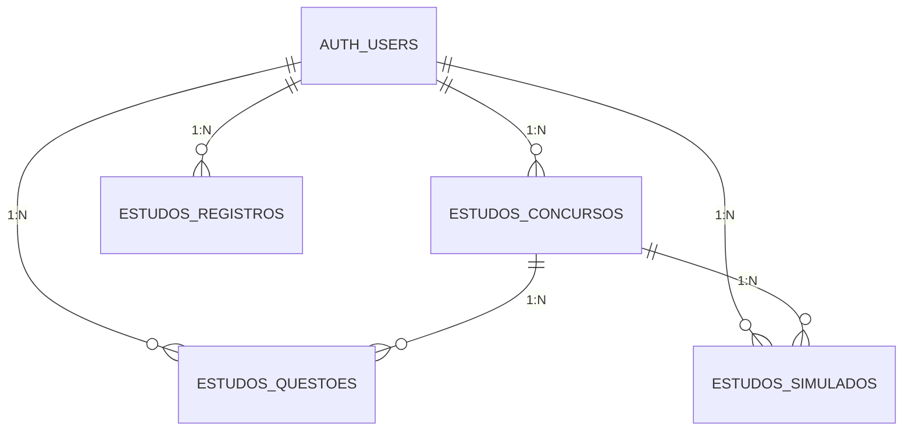
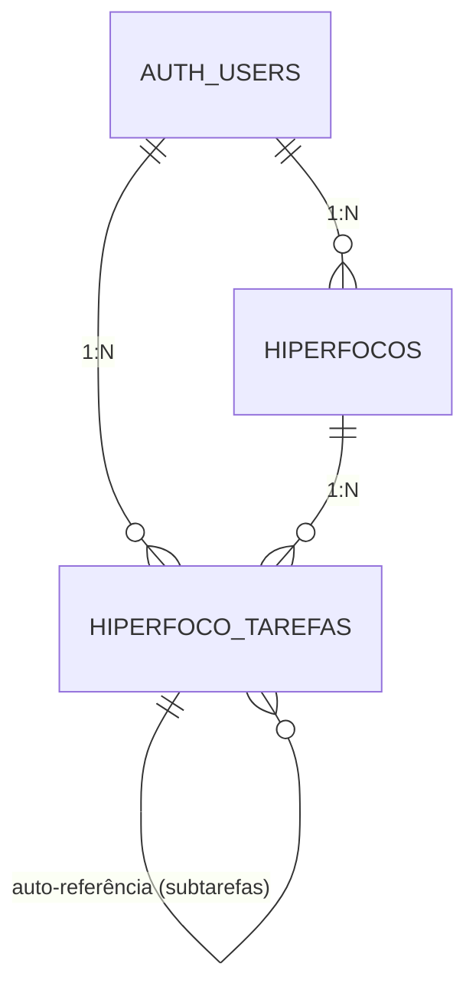
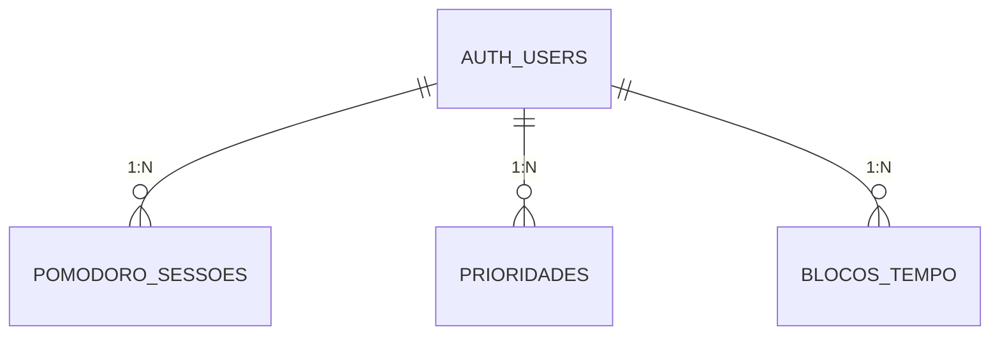

# Diagrama de Entidade-Relacionamento (ER) - StayFocus

## Diagrama Completo em Mermaid

```mermaid
erDiagram
    %% ========================================
    %% SCHEMA AUTH
    %% ========================================
    
    AUTH_USERS {
        uuid id PK
        varchar email
        timestamptz created_at
        timestamptz last_sign_in_at
        jsonb raw_user_meta_data
    }

    %% ========================================
    %% PERFIL E CONFIGURAÇÕES
    %% ========================================
    
    USERS_PROFILE {
        uuid id PK
        uuid user_id FK
        text nome
        boolean notificacoes_ativas
        boolean pausas_ativas
        timestamptz created_at
        timestamptz updated_at
    }

    PREFERENCIAS_VISUAIS {
        uuid id PK
        uuid user_id FK
        boolean alto_contraste
        boolean reducao_estimulos
        boolean texto_grande
        timestamptz updated_at
    }

    METAS_DIARIAS {
        uuid id PK
        uuid user_id FK
        integer horas_sono
        integer tarefas_prioritarias
        integer copos_agua
        integer pausas_programadas
        timestamptz updated_at
    }

    %% ========================================
    %% FINANÇAS
    %% ========================================
    
    FINANCAS_CATEGORIAS {
        uuid id PK
        uuid user_id FK
        text nome
        text cor
        text icone
        timestamptz created_at
    }

    FINANCAS_TRANSACOES {
        uuid id PK
        uuid user_id FK
        uuid categoria_id FK
        date data
        numeric valor
        text descricao
        text tipo
        timestamptz created_at
    }

    FINANCAS_ENVELOPES {
        uuid id PK
        uuid user_id FK
        text nome
        text cor
        numeric valor_alocado
        numeric valor_utilizado
        timestamptz created_at
    }

    FINANCAS_PAGAMENTOS_RECORRENTES {
        uuid id PK
        uuid user_id FK
        uuid categoria_id FK
        text descricao
        numeric valor
        text data_vencimento
        date proximo_pagamento
        boolean pago
        timestamptz created_at
    }

    %% ========================================
    %% ALIMENTAÇÃO
    %% ========================================
    
    ALIMENTACAO_REFEICOES {
        uuid id PK
        uuid user_id FK
        date data
        time hora
        text descricao
        text foto_url
        timestamptz created_at
    }

    ALIMENTACAO_PLANEJAMENTO {
        uuid id PK
        uuid user_id FK
        text horario
        text descricao
        integer dia_semana
        boolean ativo
        integer ordem
        timestamptz created_at
        timestamptz updated_at
    }

    ALIMENTACAO_HIDRATACAO {
        uuid id PK
        uuid user_id FK
        date data
        integer copos_bebidos
        integer meta_diaria
        timestamptz ultimo_registro
        text notas
        timestamptz created_at
        timestamptz updated_at
    }

    %% ========================================
    %% SAÚDE
    %% ========================================
    
    SAUDE_MEDICAMENTOS {
        uuid id PK
        uuid user_id FK
        varchar nome
        varchar dosagem
        varchar frequencia
        text[] horarios
        text observacoes
        date data_inicio
        integer intervalo_minutos
        boolean ativo
        timestamptz created_at
        timestamptz updated_at
    }

    SAUDE_TOMADAS_MEDICAMENTOS {
        uuid id PK
        uuid medicamento_id FK
        uuid user_id FK
        timestamptz data_hora
        time horario_programado
        text observacoes
        timestamptz created_at
    }

    SAUDE_REGISTROS_HUMOR {
        uuid id PK
        uuid user_id FK
        date data
        integer nivel
        text[] fatores
        text notas
        timestamptz created_at
        timestamptz updated_at
    }

    %% ========================================
    %% SONO
    %% ========================================
    
    SONO_REGISTROS {
        uuid id PK
        uuid user_id FK
        date data
        time hora_dormir
        time hora_acordar
        integer qualidade
        text observacoes
        timestamptz created_at
    }

    %% ========================================
    %% ESTUDOS
    %% ========================================
    
    ESTUDOS_CONCURSOS {
        uuid id PK
        uuid user_id FK
        text nome
        date data_prova
        text instituicao
        text cargo
        text[] disciplinas
        text status
        timestamptz created_at
    }

    ESTUDOS_QUESTOES {
        uuid id PK
        uuid user_id FK
        uuid concurso_id FK
        text disciplina
        text enunciado
        jsonb alternativas
        text resposta_correta
        text explicacao
        text[] tags
        timestamptz created_at
    }

    ESTUDOS_SIMULADOS {
        uuid id PK
        uuid user_id FK
        uuid concurso_id FK
        text titulo
        uuid[] questoes_ids
        timestamptz data_realizacao
        integer tempo_limite_minutos
        integer acertos
        integer total_questoes
        timestamptz created_at
    }

    ESTUDOS_REGISTROS {
        uuid id PK
        uuid user_id FK
        date data
        text disciplina
        integer duracao_minutos
        text[] topicos
        text observacoes
        timestamptz created_at
    }

    %% ========================================
    %% HIPERFOCOS
    %% ========================================
    
    HIPERFOCOS {
        uuid id PK
        uuid user_id FK
        text titulo
        text descricao
        date data_inicio
        date data_fim
        integer intensidade
        text status
        timestamptz created_at
    }

    HIPERFOCO_TAREFAS {
        uuid id PK
        uuid hiperfoco_id FK
        uuid user_id FK
        uuid tarefa_pai_id FK
        text texto
        boolean concluida
        integer ordem
        text cor
        timestamptz created_at
        timestamptz updated_at
    }

    %% ========================================
    %% PRODUTIVIDADE
    %% ========================================
    
    POMODORO_SESSOES {
        uuid id PK
        uuid user_id FK
        date data
        integer duracao_minutos
        text tipo
        text tarefa
        boolean concluida
        timestamptz created_at
    }

    PRIORIDADES {
        uuid id PK
        uuid user_id FK
        date data
        text titulo
        text categoria
        integer nivel_prioridade
        boolean concluida
        timestamptz created_at
    }

    BLOCOS_TEMPO {
        uuid id PK
        uuid user_id FK
        text hora
        text atividade
        text categoria
        date data
        timestamptz created_at
        timestamptz updated_at
    }

    %% ========================================
    %% LAZER E AUTOCONHECIMENTO
    %% ========================================
    
    ATIVIDADES {
        uuid id PK
        uuid user_id FK
        date data
        text titulo
        text categoria
        integer duracao_minutos
        text observacoes
        timestamptz created_at
    }

    AUTOCONHECIMENTO_REGISTROS {
        uuid id PK
        uuid user_id FK
        date data
        text tipo
        integer nivel
        text[] gatilhos
        text observacoes
        timestamptz created_at
    }

    %% ========================================
    %% RECEITAS
    %% ========================================
    
    RECEITAS {
        uuid id PK
        uuid user_id FK
        text titulo
        jsonb ingredientes
        text modo_preparo
        integer tempo_preparo_minutos
        integer porcoes
        text categoria
        text foto_url
        boolean favorita
        timestamptz created_at
    }

    LISTA_COMPRAS {
        uuid id PK
        uuid user_id FK
        text item
        text quantidade
        text categoria
        boolean comprado
        timestamptz created_at
    }

    %% ========================================
    %% RELACIONAMENTOS
    %% ========================================
    
    %% Perfil e Configurações
    AUTH_USERS ||--o| USERS_PROFILE : "tem"
    AUTH_USERS ||--o| PREFERENCIAS_VISUAIS : "tem"
    AUTH_USERS ||--o| METAS_DIARIAS : "tem"

    %% Finanças
    AUTH_USERS ||--o{ FINANCAS_CATEGORIAS : "cria"
    AUTH_USERS ||--o{ FINANCAS_TRANSACOES : "registra"
    AUTH_USERS ||--o{ FINANCAS_ENVELOPES : "gerencia"
    AUTH_USERS ||--o{ FINANCAS_PAGAMENTOS_RECORRENTES : "cadastra"
    FINANCAS_CATEGORIAS ||--o{ FINANCAS_TRANSACOES : "categoriza"
    FINANCAS_CATEGORIAS ||--o{ FINANCAS_PAGAMENTOS_RECORRENTES : "categoriza"

    %% Alimentação
    AUTH_USERS ||--o{ ALIMENTACAO_REFEICOES : "registra"
    AUTH_USERS ||--o{ ALIMENTACAO_PLANEJAMENTO : "planeja"
    AUTH_USERS ||--o{ ALIMENTACAO_HIDRATACAO : "monitora"

    %% Saúde
    AUTH_USERS ||--o{ SAUDE_MEDICAMENTOS : "cadastra"
    AUTH_USERS ||--o{ SAUDE_TOMADAS_MEDICAMENTOS : "registra"
    AUTH_USERS ||--o{ SAUDE_REGISTROS_HUMOR : "monitora"
    SAUDE_MEDICAMENTOS ||--o{ SAUDE_TOMADAS_MEDICAMENTOS : "tem"

    %% Sono
    AUTH_USERS ||--o{ SONO_REGISTROS : "registra"

    %% Estudos
    AUTH_USERS ||--o{ ESTUDOS_CONCURSOS : "estuda"
    AUTH_USERS ||--o{ ESTUDOS_QUESTOES : "cadastra"
    AUTH_USERS ||--o{ ESTUDOS_SIMULADOS : "realiza"
    AUTH_USERS ||--o{ ESTUDOS_REGISTROS : "registra"
    ESTUDOS_CONCURSOS ||--o{ ESTUDOS_QUESTOES : "contém"
    ESTUDOS_CONCURSOS ||--o{ ESTUDOS_SIMULADOS : "gera"

    %% Hiperfocos
    AUTH_USERS ||--o{ HIPERFOCOS : "tem"
    AUTH_USERS ||--o{ HIPERFOCO_TAREFAS : "cria"
    HIPERFOCOS ||--o{ HIPERFOCO_TAREFAS : "contém"
    HIPERFOCO_TAREFAS ||--o{ HIPERFOCO_TAREFAS : "tem_subtarefas"

    %% Produtividade
    AUTH_USERS ||--o{ POMODORO_SESSOES : "realiza"
    AUTH_USERS ||--o{ PRIORIDADES : "define"
    AUTH_USERS ||--o{ BLOCOS_TEMPO : "organiza"

    %% Lazer e Autoconhecimento
    AUTH_USERS ||--o{ ATIVIDADES : "registra"
    AUTH_USERS ||--o{ AUTOCONHECIMENTO_REGISTROS : "monitora"

    %% Receitas
    AUTH_USERS ||--o{ RECEITAS : "cria"
    AUTH_USERS ||--o{ LISTA_COMPRAS : "gerencia"
```



## Diagrama Simplificado por Módulos

### 1. Módulo de Perfil



### 2. Módulo de Finanças



### 3. Módulo de Alimentação



### 4. Módulo de Saúde



### 5. Módulo de Estudos



### 6. Módulo de Hiperfocos



### 7. Módulo de Produtividade



## Cardinalidades

| Relacionamento | Tipo | Descrição |
|----------------|------|-----------|
| `users → users_profile` | 1:1 | Cada usuário tem um perfil único |
| `users → preferencias_visuais` | 1:1 | Cada usuário tem preferências visuais únicas |
| `users → metas_diarias` | 1:1 | Cada usuário tem metas diárias únicas |
| `users → financas_categorias` | 1:N | Um usuário pode ter várias categorias |
| `financas_categorias → financas_transacoes` | 1:N | Uma categoria pode ter várias transações |
| `users → saude_medicamentos` | 1:N | Um usuário pode ter vários medicamentos |
| `saude_medicamentos → saude_tomadas_medicamentos` | 1:N | Um medicamento pode ter várias tomadas |
| `users → hiperfocos` | 1:N | Um usuário pode ter vários hiperfocos |
| `hiperfocos → hiperfoco_tarefas` | 1:N | Um hiperfoco pode ter várias tarefas |
| `hiperfoco_tarefas → hiperfoco_tarefas` | 1:N | Uma tarefa pode ter várias subtarefas |
| `users → estudos_concursos` | 1:N | Um usuário pode estudar para vários concursos |
| `estudos_concursos → estudos_questoes` | 1:N | Um concurso pode ter várias questões |

## Índices Recomendados

### Índices de Performance

```sql
-- Índices para melhorar performance de queries frequentes

-- Finanças
CREATE INDEX idx_financas_transacoes_user_data ON financas_transacoes(user_id, data DESC);
CREATE INDEX idx_financas_transacoes_categoria ON financas_transacoes(categoria_id);

-- Alimentação
CREATE INDEX idx_alimentacao_refeicoes_user_data ON alimentacao_refeicoes(user_id, data DESC);
CREATE INDEX idx_alimentacao_hidratacao_user_data ON alimentacao_hidratacao(user_id, data DESC);

-- Saúde
CREATE INDEX idx_saude_tomadas_user_data ON saude_tomadas_medicamentos(user_id, data_hora DESC);
CREATE INDEX idx_saude_tomadas_medicamento ON saude_tomadas_medicamentos(medicamento_id);
CREATE INDEX idx_saude_humor_user_data ON saude_registros_humor(user_id, data DESC);

-- Hiperfocos
CREATE INDEX idx_hiperfoco_tarefas_hiperfoco ON hiperfoco_tarefas(hiperfoco_id);
CREATE INDEX idx_hiperfoco_tarefas_pai ON hiperfoco_tarefas(tarefa_pai_id) WHERE tarefa_pai_id IS NOT NULL;
CREATE INDEX idx_hiperfocos_status ON hiperfocos(user_id, status);

-- Estudos
CREATE INDEX idx_estudos_questoes_concurso ON estudos_questoes(concurso_id);
CREATE INDEX idx_estudos_simulados_concurso ON estudos_simulados(concurso_id);

-- Produtividade
CREATE INDEX idx_prioridades_user_data ON prioridades(user_id, data DESC);
CREATE INDEX idx_blocos_tempo_user_data ON blocos_tempo(user_id, data);
```

## Constraints e Validações

### Check Constraints Importantes

| Tabela | Constraint | Validação |
|--------|-----------|-----------|
| `metas_diarias` | `horas_sono` | 1 ≤ valor ≤ 24 |
| `metas_diarias` | `tarefas_prioritarias` | 1 ≤ valor ≤ 20 |
| `metas_diarias` | `copos_agua` | 1 ≤ valor ≤ 30 |
| `financas_transacoes` | `tipo` | 'receita' ou 'despesa' |
| `financas_envelopes` | `valor_alocado` | ≥ 0 |
| `financas_envelopes` | `valor_utilizado` | ≥ 0 |
| `alimentacao_hidratacao` | `copos_bebidos` | 0 ≤ valor ≤ 50 |
| `alimentacao_hidratacao` | `meta_diaria` | 1 ≤ valor ≤ 20 |
| `saude_medicamentos` | `intervalo_minutos` | > 0 |
| `saude_medicamentos` | `horarios` | array_length > 0 |
| `saude_registros_humor` | `nivel` | 1 ≤ valor ≤ 5 |
| `sono_registros` | `qualidade` | 1 ≤ valor ≤ 5 |
| `hiperfocos` | `intensidade` | 1 ≤ valor ≤ 5 |
| `hiperfocos` | `status` | 'ativo', 'pausado' ou 'concluido' |
| `prioridades` | `nivel_prioridade` | 1 ≤ valor ≤ 3 |
| `pomodoro_sessoes` | `tipo` | 'foco' ou 'pausa' |

## Políticas RLS (Row Level Security)

Todas as tabelas do schema `public` têm RLS habilitado com a seguinte política padrão:

```sql
-- Política padrão para todas as tabelas
CREATE POLICY "Users can only access their own data"
ON table_name
FOR ALL
USING (auth.uid() = user_id);
```

### Exceções e Políticas Especiais

- **Storage**: Políticas configuradas para permitir upload de fotos de refeições e receitas
- **Auth**: Gerenciado automaticamente pelo Supabase

---

**Última atualização:** 19 de Outubro de 2025
